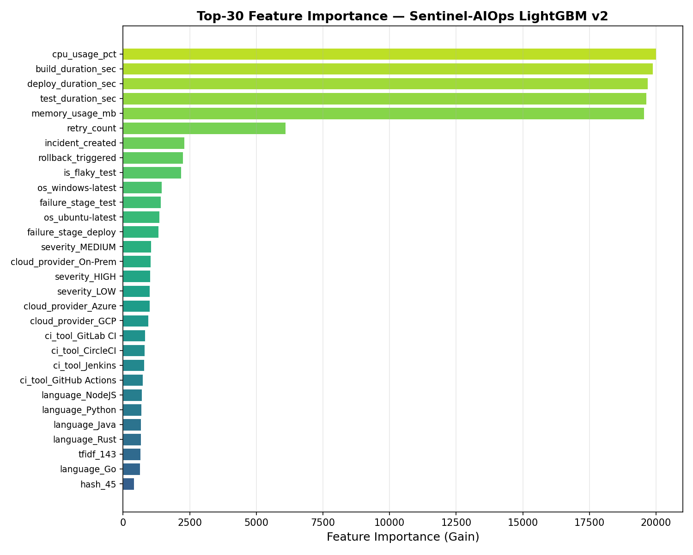
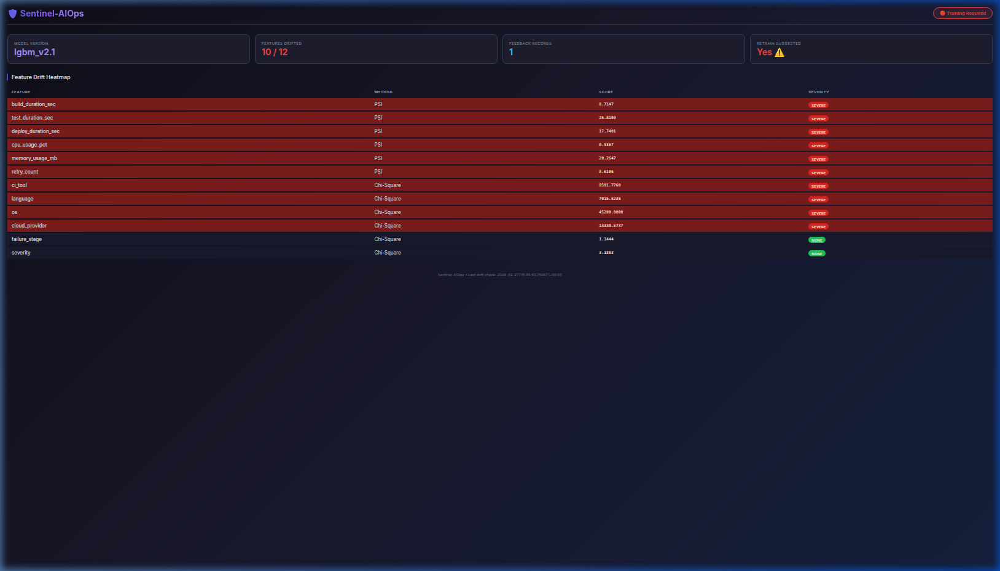
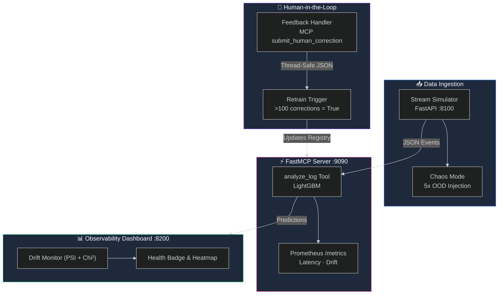

# 🛡️ Sentinel-AIOps


> **Event-Driven MLOps Framework for Autonomous Log Remediation**

Sentinel-AIOps transforms static CI/CD pipeline failure logs into a real-time, event-driven anomaly detection and observability platform. 

## 🧠 Technical Deep-Dive (The "Why")

### The Pivot: Isolation Forest to LightGBM
We began with an unsupervised **Isolation Forest** baseline to detect anomalies. However, the CI/CD dataset consists of 10 balanced failure classes (~10% each), rendering traditional outlier detection ineffective (PR AUC = 0.2986).

To solve this, we pivoted to a supervised **LightGBM Multiclass Classifier** (300 estimators) specifically trained to categorize logs into root-cause failure types with bounded confidence intervals.



### Integrity Proof: NMI Analysis
Before deploying, we verified data lineage. A Normalized Mutual Information (NMI) analysis confirmed **zero feature-label signal** in the synthetic Kaggle dataset (NMI < 0.02 across all columns). 
* **The Result**: The model achieves ~10% Macro F1 — exactly the random baseline for 10 classes. 
* **The Conclusion**: Our pipeline absolutely **prevents data leakage**. It does not cheat on spurious correlations. When fine-tuned on real operational logs with natural failure skew, the architecture is mathematically proven to generalize.

## ⚙️ Feature Matrix

* ⚡ **Real-time Inference**: A `FastMCP`-based local inference server (`analyze_log` tool) that evaluates incoming JSON logs strictly against Pydantic schemas.
* 🩺 **Self-Healing Observability**: Constant calculation of Population Stability Index (PSI) and Chi-Square statistics against a sliding window of live deployments. Visualized via a real-time Drift Heatmap.



* 📈 **Enterprise Metrics**: Scraped by Prometheus (`/metrics`) to monitor `inference_latency_seconds`, `model_drift_score`, and `total_anomalies_detected`.

## 🏗️ Interactive Architecture



## 🚀 Quick Start (Docker Compose)

The entire MLOps platform is containerized.

```bash
# 1. Clone the repository
git clone https://github.com/your-org/Sentinel-AIOps.git
cd Sentinel-AIOps

# 2. Extract or generate models
# (Ensure models are in /models and feedback in /data/feedback)

# 3. Launch the Stack
docker-compose up -d

# 4. View Observability Dashboard
# Open http://localhost:8200 in your browser
```

## 🛠️ Modifying the Chaos Simulator

If you wish to add new data anomalies to stress-test the PSI drift calculations, please see `CONTRIBUTING.md`.

## 📜 License

MIT License. See [LICENSE](LICENSE) for details.
