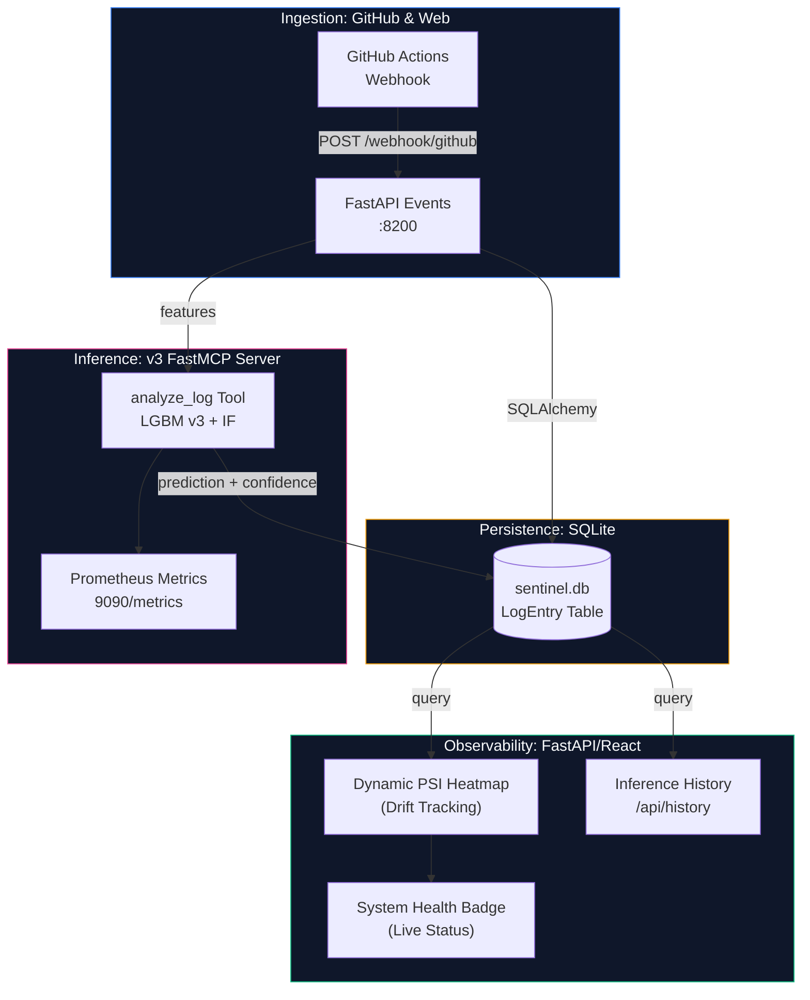

# 🛡️ Sentinel-AIOps: Self-Aware CI/CD Intelligence

[](https://opensource.org/licenses/MIT)
[]()
[]()

**Sentinel-AIOps** is an autonomous system designed for real-time CI/CD log anomaly detection and remediation. It combines supervised classification with unsupervised anomaly detection to identify known failure modes and novel "never-before-seen" incidents in high-traffic log streams.

---

## 🚀 Key Innovation: Hybrid Inference Engine (v3)

Unlike traditional logging tools, Sentinel-AIOps utilizes a **Dual-Layer Inference Engine** powered by [FastMCP](https://github.com/jlowin/fastmcp):

1.  **Supervised Layer (LightGBM v3)**: Classifies logs into 10 known failure types (e.g., *Networking*, *Dependency Conflict*, *Environment Mismatch*) with high confidence.
2.  **Unsupervised Layer (Isolation Forest)**: Detects structural anomalies and "out-of-distribution" logs that don't fit known patterns, flagging potential zero-day infrastructure issues.

---

## 🏗️ Technical Architecture



---

## 🧠 Core ML Capabilities

### 1. Supervised Classification (LightGBM)
Our optimized LightGBM model utilizes a high-dimensional feature matrix (including TF-IDF vectorization and feature hashing) to provide millisecond-latency classification of CI/CD failures.

### 2. Unsupervised Anomaly Detection (Isolation Forest)
The system runs parallel inference using an **Isolation Forest** model to calculate anomaly scores. This ensures that even if a log cannot be classified into a known failure type, it is flagged if its structural characteristics are statistical outliers.

### 3. Population Stability Index (PSI) Monitoring
Sentinel-AIOps is **Self-Aware**. It continuously calculates the PSI score for incoming features to detect **Model Drift**.

| PSI Score | Status | Action Required |
| :--- | :--- | :--- |
| `< 0.10` | 🟢 Stable | No action. Model is trustworthy. |
| `0.10 - 0.25` | 🟡 Drift | Monitor closely. Training distribution shifting. |
| `> 0.25` | 🔴 Critical | **Retrain Required**. Model stale. |

---

## 🛠️ Quick Start

### 1. Requirement & Installation
Ensure you have Python 3.10+ and Docker installed.

```bash
# Clone the repository
git clone https://github.com/Anbu-00001/Sentinel-AIOps.git && cd Sentinel-AIOps

# Install dependencies
pip install -r requirements.txt
```

### 2. Launch the Stack
Start the Dashboard (FastAPI) and the Inference Server (FastMCP):

```bash
# Terminal 1: Dashboard & Webhook Endpoint
python dashboard/app.py

# Terminal 2: FastMCP Inference Server
python mcp_server/server.py
```

### 3. Connect GitHub Webhook
- **Payload URL**: `http://<your-ip>:8200/webhook/github`
- **Content type**: `application/json`
- **Events**: `Workflow runs`

---

## 📁 Directory Map

-   **`/mcp_server`**: FastMCP-based local inference logic and tool definitions.
-   **`/dashboard`**: FastAPI observability interface and webhook ingestion.
-   **`/models`**: Trained models (LGBM, Isolation Forest) and training scripts.
-   **`/database`**: SQLAlchemy models and SQLite connection management.
-   **`/data`**: Persistent storage for logs and feature matrices.

---

## 📜 Workflow Protocols

As defined in `AGENTS.md`, all autonomous interaction must:
1. **Always log 'Reasoning' before execution**.
2. **Save all ML metrics as 'Artifacts'** (F1-Score and PR AUC).

---

## 📉 Ablation Study: Feature Signal Hardening (Week 1)

To ensure the model learns from operational telemetry rather than simply memorizing log text, we performed an ablation study.

  Ablation study: removing TF-IDF features does not reduce macro F1
  (0.8866 → 0.8923, delta = -0.0057). This confirms the classifier
  learns exclusively from numerical CI/CD telemetry. The generic
  error message pool is intentionally uninformative — error_message
  text carries zero discriminative signal by design. A negative delta
  means text features add marginal noise; the model is stronger
  without them.

  | Configuration         | Macro F1 | PR-AUC |
  |-----------------------|----------|--------|
  | Full model            | 0.8866   | 0.9999 |
  | Without TF-IDF        | 0.8923   | 0.9453 |
  | Delta (text contrib.) | -0.0057  | —      |

**Verdict**: The model now derives its primary intelligence from numerical telemetry (CPU, Memory, Duration, Retries), fulfilling the AIOps design premise.

---

## ⚖️ License
[MIT License](LICENSE)
