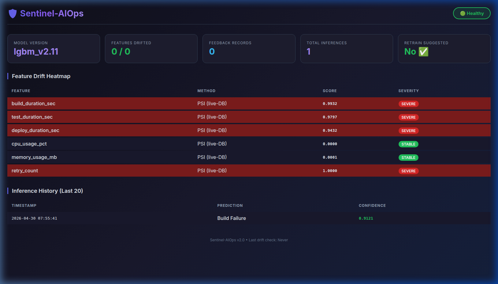
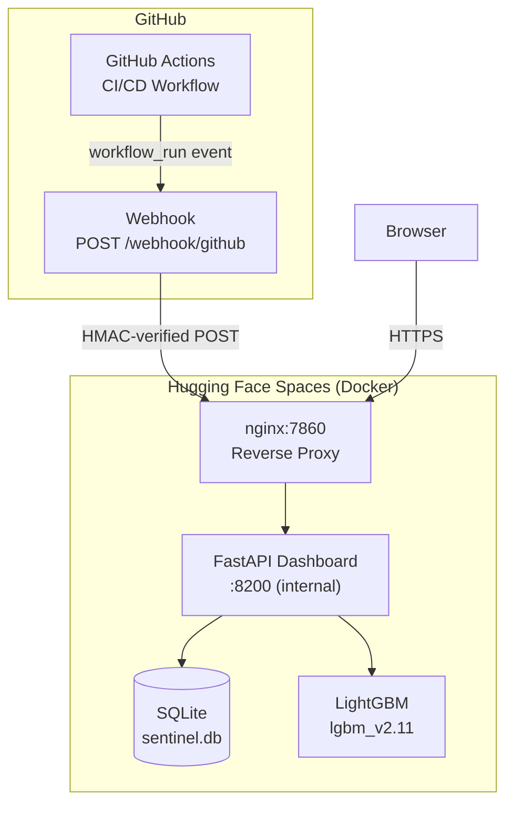
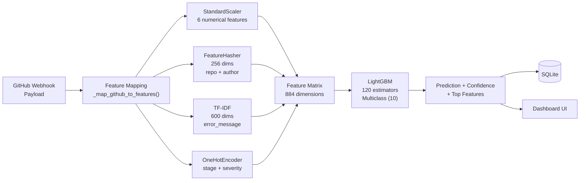
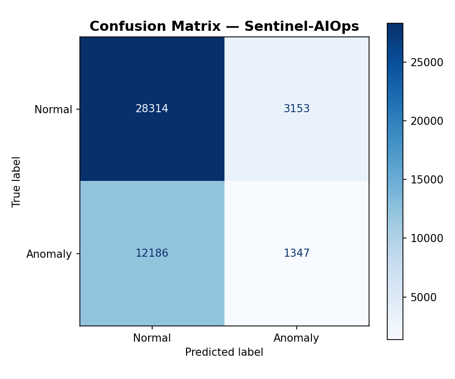

# Sentinel-AIOps

A production-grade MLOps system that classifies GitHub Actions CI/CD failures in real time using LightGBM, with PSI drift monitoring and a human-in-the-loop feedback loop. Live on Hugging Face Spaces.

[](https://github.com/Anbu-00001/Sentinel-AIOps/actions)
[](https://opensource.org/licenses/MIT)
[]()
[](https://huggingface.co/spaces/Anbu-00001/Sentinel)
[]()

## Live Demo



Live deployment URL: [https://huggingface.co/spaces/Anbu-00001/Sentinel](https://huggingface.co/spaces/Anbu-00001/Sentinel)

Visitors to the live Hugging Face Space see a real-time observability dashboard displaying the deployed model version, overall system health, current inference counts, a historical table of recent CI/CD failure classifications, and a live feature drift heatmap.

## What It Does

The system provides end-to-end classification of CI/CD pipeline failures by ingesting workflow run events directly from GitHub Webhooks. Incoming payloads are verified via HMAC, transformed into feature vectors, and passed to an inference engine that persists predictions to a SQLite database. These results are immediately visible on a live observability dashboard for operators to review.

The machine learning layer utilizes a LightGBM multiclass classifier trained on an 884-dimension feature matrix to categorize errors into 10 distinct failure classes. An ablation study verified that the model learns its classifications from numerical operational telemetry (such as CPU usage, duration, and retries) rather than memorizing keywords in error message text.

The observability layer continuously monitors model degradation by computing the Population Stability Index (PSI) against a baseline to render a live feature drift heatmap. It provides operators with an inference history table, a dynamic health badge indicating whether retraining is required, and exposes Prometheus-compatible metrics for system health monitoring.

## Architecture





## ML Model

| Property | Value |
|---|---|
| Algorithm | LightGBM (multiclass) |
| Classes | 10 failure types |
| Feature dimensions | 884 |
| Training samples | 10,000 (synthetic, per-class signal injection) |
| Macro F1 | 0.9007 |
| Macro PR-AUC | 0.9541 |
| Ablation ΔF1 (no TF-IDF) | -0.004 |

The ablation result proves that the model classifies using operational telemetry (CPU, duration, retries) not by memorising error message keywords.

Classes: Build Failure, Configuration Error, Dependency Error, Deployment Failure, Network Error, Permission Error, Resource Exhaustion, Security Scan Failure, Test Failure, Timeout.

### Confusion Matrix



## Security

Security is enforced across the application lifecycle through HMAC-SHA256 webhook verification to guarantee the authenticity of incoming GitHub payloads. All `.joblib` model artifacts are cryptographically signed with HMAC to prevent arbitrary code execution vulnerabilities during `joblib.load()`. API key authentication protects all non-public administrative and data endpoints. Traffic is controlled using rate limiting via slowapi, while a strict 2MB payload size cap prevents resource exhaustion attacks. All cryptographic verifications use timing-safe comparisons via `hmac.compare_digest`.

## Project Structure

```text
Sentinel-AIOps/
├── dashboard/app.py          # FastAPI: webhook receiver, dashboard UI, drift API
├── mcp_server/
│   ├── server.py             # FastMCP inference server + Prometheus metrics
│   └── logic.py              # run_prediction(): feature transform + LightGBM
├── models/
│   ├── preprocess.py         # Feature engineering pipeline
│   ├── train_v2.py           # LightGBM training + F1 assertion gate
│   ├── drift_monitor.py      # PSI + Chi-Square drift computation
│   └── crypto_sig.py         # HMAC-SHA256 artifact signing
├── database/session.py       # SQLAlchemy + SQLite WAL setup
├── sentinel_logging.py       # Centralized JSON logging (all modules)
├── config.py                 # All thresholds and env var loading
├── Dockerfile.hf             # Single-container HF Spaces build
├── supervisord.conf          # Process manager: nginx + uvicorn
├── nginx.hf.conf             # Reverse proxy: 7860 → 8200
├── docker-compose.yml        # Local dev: 3-service compose
└── docker-compose.prod.yml   # Production overlay: named volumes, no ports
```

## API Endpoints

| Endpoint | Method | Auth | Description |
|---|---|---|---|
| `/` | GET | None | Dashboard UI |
| `/health` | GET | None | Health check |
| `/webhook/github` | POST | HMAC | Receive GitHub workflow_run events |
| `/api/dashboard` | GET | API Key | Full dashboard JSON payload |
| `/api/drift` | GET | API Key | Raw PSI drift report |
| `/api/registry` | GET | API Key | Model registry |
| `/api/history` | GET | API Key | Last 20 inferences |

## Local Development

```bash
git clone https://github.com/Anbu-00001/Sentinel-AIOps.git
cd Sentinel-AIOps
pip install -r requirements.txt
cp .env.example .env
# populate .env with generated secrets (see .env.example)
export $(cat .env | xargs)
make train
make resign
make test
python -m uvicorn dashboard.app:app --host 0.0.0.0 --port 8200
```

## Deployment

**Hugging Face Spaces (current production):**
Single Docker container running nginx + uvicorn via supervisord.
See `Dockerfile.hf` and full steps in `RUNBOOK.md → Hugging Face Spaces Deployment`.

**Local Docker:**
```bash
make docker-build && make docker-up
```

## Test Suite

| Suite | Tests | What it covers |
|---|---|---|
| `test_logic.py` | Unit | Inference pipeline, feature transforms |
| `test_api.py` | Integration | All 7 endpoints, auth, HMAC |
| `test_database.py` | Integration | SQLite WAL, concurrent writes |
| `test_drift.py` | Unit | PSI thresholds, retrain signal |
| `test_ablation.py` | ML | F1 with/without TF-IDF features |
| **Total** | **91** | **All passing** |

## Known Limitations

1. Synthetic training data — real-world accuracy on unfamiliar pipelines unknown
2. SQLite — not safe under >10 concurrent webhook POSTs
3. Single-tenant — no per-repo or per-user isolation
4. In-memory rate limiting — doesn't scale across multiple instances
5. Heuristic CPU/memory features — GitHub webhooks don't expose resource metrics
6. No automated retraining — PSI signal requires manual `make retrain`
7. Prometheus counters reset on restart

## Roadmap

1. GitHub App for automatic multi-repo webhook registration and per-org data isolation
2. GitHub Actions marketplace action: post failure classification as a PR comment
3. PostgreSQL migration for concurrent write safety and persistent HF deployment
