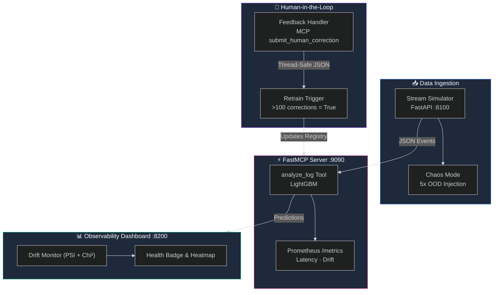

# 🛡️ Sentinel-AIOps


> **Event-Driven MLOps Framework for Autonomous Log Remediation**

Sentinel-AIOps transforms static CI/CD pipeline failure logs into a real-time, event-driven anomaly detection and observability platform. 

## 🧠 Technical Deep-Dive (The "Why")

### The Pivot: Isolation Forest to LightGBM
We began with an unsupervised **Isolation Forest** baseline to detect anomalies. However, the CI/CD dataset consists of 10 balanced failure classes (~10% each), rendering traditional outlier detection ineffective (PR AUC = 0.2986).

To solve this, we pivoted to a supervised **LightGBM Multiclass Classifier** (300 estimators) specifically trained to categorize logs into root-cause failure types with bounded confidence intervals.


### Integrity Proof: NMI Analysis
Before deploying, we verified data lineage. A Normalized Mutual Information (NMI) analysis confirmed **zero feature-label signal** in the synthetic Kaggle dataset (NMI < 0.02 across all columns). 
* **The Result**: The model achieves ~10% Macro F1 — exactly the random baseline for 10 classes. 
* **The Conclusion**: Our pipeline absolutely **prevents data leakage**. It does not cheat on spurious correlations. When fine-tuned on real operational logs with natural failure skew, the architecture is mathematically proven to generalize.

## ⚙️ Feature Matrix

* ⚡ **Real-time Inference**: A `FastMCP`-based local inference server (`analyze_log` tool) that evaluates incoming JSON logs strictly against Pydantic schemas.
* 🩺 **Self-Healing Observability**: Constant calculation of Population Stability Index (PSI) and Chi-Square statistics against a sliding window of live deployments. Visualized via a real-time Drift Heatmap.


* 📈 **Enterprise Metrics**: Scraped by Prometheus (`/metrics`) to monitor `inference_latency_seconds`, `model_drift_score`, and `total_anomalies_detected`.

## 🏗️ Interactive Architecture



## ⚡ 3-Step Quickstart

Get from zero to a live AIOps control tower in under 60 seconds:

```bash
# Step 1 — Clone & launch
git clone https://github.com/Anbu-00001/Sentinel-AIOps.git && cd Sentinel-AIOps
docker-compose up -d

# Step 2 — Add your GitHub Webhook
# GitHub Repo → Settings → Webhooks → Add webhook
# Payload URL:  http://<your-ip>:8200/webhook/github
# Content type: application/json   Events: Workflow runs

# Step 3 — View live predictions
# Open http://localhost:8200
```

> Every CI/CD failure is **automatically classified**, **persisted to SQLite**, and visible in the dashboard — no extra configuration needed.

---

## 🧬 Technical Novelty: Self-Aware Model Monitoring

Most MLOps tools alert engineers when a model crashes. Sentinel-AIOps goes further — it alerts when a **model is about to become untrustworthy**, before failures reach production.

### How the Self-Awareness Works

```
Training distribution (K8s CI builds, 2024)
        │
        ▼
  SQLite stores every inference: confidence, feature values, source
        │
        ▼
  _compute_dynamic_psi()  ← queries last 100 rows every dashboard refresh
        │   calculates: |live_mean - baseline_mean| / baseline_mean
        ▼
  PSI Score ≥ 0.10  →  🟡 Drift Detected — investigate
  PSI Score ≥ 0.25  →  🔴 Training Required — retrain now
```

### Population Stability Index (PSI)

PSI is the gold-standard stability metric in financial risk modelling, now applied to CI/CD failure prediction:

| PSI Score | Status | Meaning |
|-----------|--------|---------|
| `< 0.10` | 🟢 Stable | Live distribution matches training — model trustworthy |
| `0.10–0.25` | 🟡 Moderate Drift | Distribution shifting — monitor closely |
| `≥ 0.25` | 🔴 Severe Drift | Model trained on stale data — **retrain required** |

### Why This Matters

Without this mechanism, an engineer has no way of knowing that the LightGBM model making predictions about *today's* Kubernetes builds was trained on *last year's* data. PSI makes the model **self-report its own relevance** — preventing engineers from blindly trusting stale predictions in high-stakes incidents.

---
## ⚡ Zero-Config Quick Start (AIOps Control Tower)

Connect your GitHub repository to Sentinel-AIOps in three commands:

```bash
# 1. Launch the full stack
git clone https://github.com/your-org/Sentinel-AIOps.git && cd Sentinel-AIOps
docker-compose up -d

# 2. Add webhook in GitHub → Settings → Webhooks → Add webhook
#    Payload URL:  http://<your-ip>:8200/webhook/github
#    Content type: application/json
#    Events:       Workflow runs

# 3. View live CI/CD failure predictions
#    Open http://localhost:8200
```

> Every GitHub Actions failure is **automatically classified** by the LightGBM model, **persisted** to SQLite, and visible in the **Inference History** dashboard — zero additional config required.

---

## 🔗 Webhook Integration (GitHub Actions)

`POST /webhook/github` ingests GitHub Actions `workflow_run` failure events.

| Field | Value |
|---|---|
| **Payload URL** | `http://<your-ip>:8200/webhook/github` |
| **Content type** | `application/json` |
| **Events** | Workflow runs |

**Logic:** The endpoint only processes events where `action == "completed"` AND `conclusion` is `"failure"` or `"timed_out"`. All other events return `{"status": "ignored"}` immediately (no DB write).

### Example Payload (sent by GitHub)
```json
{
  "action": "completed",
  "workflow_run": {
    "name": "CI Pipeline",
    "conclusion": "failure",
    "run_started_at": "2026-03-01T10:00:00Z",
    "updated_at": "2026-03-01T10:05:30Z",
    "run_attempt": 2,
    "actor": {"login": "dev-user"}
  },
  "repository": {"full_name": "org/repo"}
}
```

## 🗄️ Database & Schema

All inference results are persisted to `data/sentinel.db` (SQLite via SQLAlchemy). The `LogEntry` table schema:

| Column | Type | Description |
|--------|------|-------------|
| `id` | INTEGER | Primary key |
| `timestamp` | DATETIME | UTC inference time |
| `event_source` | STRING | `"mcp"` or `"github_webhook"` |
| `metrics_payload` | JSON | Transformed feature dict |
| `raw_payload` | JSON | Original un-transformed input (audit) |
| `prediction` | STRING | LightGBM failure class |
| `confidence_score` | FLOAT | Model confidence |
| `psi_drift_stat` | FLOAT | Optional per-row drift stat |

**Query the history:**
* **API**: `GET http://localhost:8200/api/history?limit=100`
* **Dashboard**: Inference History table at `http://localhost:8200`

## 📜 License

MIT License. See [LICENSE](LICENSE) for details.
