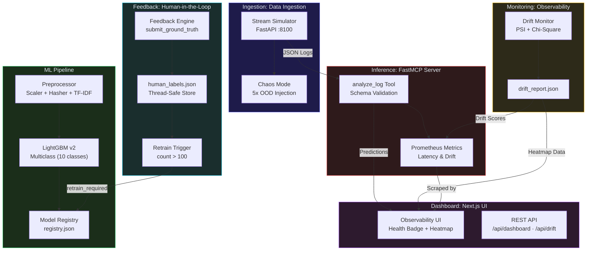
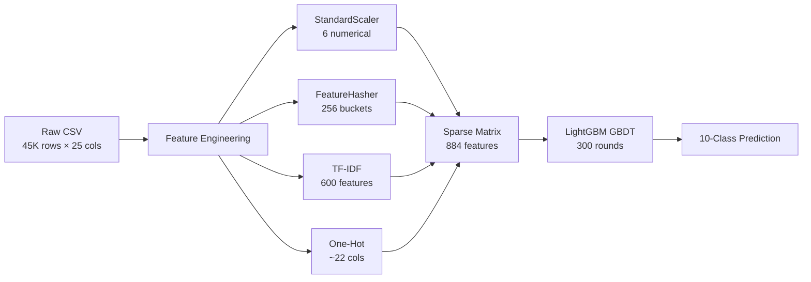
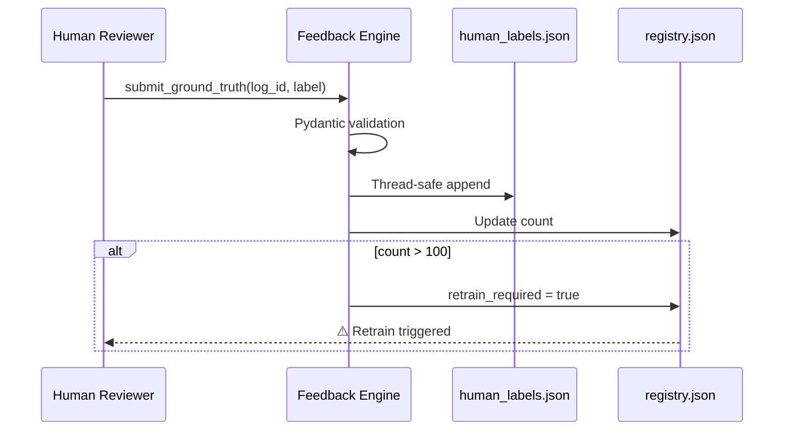
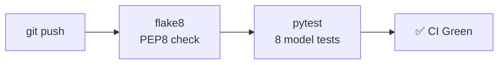

# 🏗️ SYSTEM_DESIGN.md — Sentinel-AIOps Architecture

## Overview

Sentinel-AIOps is an event-driven MLOps platform for CI/CD log anomaly detection. The system ingests real-time log streams, classifies failures using a LightGBM multiclass model, monitors feature drift, collects human feedback, and exposes observability metrics via Prometheus.

## End-to-End Architecture



## Component Details

### 1. Data Ingestion (`/data/stream_simulator.py`)

| Endpoint | Method | Description |
|---|---|---|
| `/health` | GET | Health check |
| `/stream?count=N&chaos=level` | GET | Batch log generation |
| `/stream/single?chaos=level` | GET | Single log record |

**Chaos Levels**: `none` (0%), `low` (10%), `medium` (30%), `high` (60%), `extreme` (100%)

OOD injection multiplies all numerical features by **5x** above training maximum.

### 2. ML Pipeline (`/models/`)



### 3. Inference Server (`/mcp-server/server.py`)

**Prometheus Metrics** exposed on `:9090/metrics`:

| Metric | Type | Description |
|---|---|---|
| `inference_latency_seconds` | Histogram | Per-request inference time |
| `total_anomalies_detected` | Counter | Logs classified with confidence > 0.5 |
| `total_inferences` | Counter | All inference requests |
| `model_drift_score` | Gauge | Max PSI score from drift report |
| `inference_errors_total` | Counter | Failed inference requests |

### 4. Drift Monitor (`/models/drift_monitor.py`)

| Feature Type | Method | Threshold |
|---|---|---|
| Numerical | PSI (Population Stability Index) | > 0.2 → retrain |
| Categorical | Chi-Square test | p < 0.05 → drifted |

### 5. Feedback Loop (`/mcp-server/feedback_engine.py`)



### 6. Dashboard (`/dashboard/app.py`)

| Endpoint | Description |
|---|---|
| `/` | Full HTML dashboard with drift heatmap |
| `/api/dashboard` | JSON payload (health, heatmap, model info) |
| `/api/drift` | Raw drift report |
| `/api/registry` | Model registry |

**Health Badge Logic**:
- 🟢 **Healthy** — No features drifted
- 🟡 **Drift Detected** — Some features drifted, PSI < threshold
- 🔴 **Training Required** — PSI > 0.2 on any numerical feature

## Infrastructure

### Docker Compose Services

| Service | Port | Container |
|---|---|---|
| MCP Server | 9090 | `sentinel-mcp` |
| Stream Simulator | 8100 | `sentinel-stream` |
| Dashboard | 8200 | `sentinel-dashboard` |

### CI/CD Pipeline (`.github/workflows/ci.yml`)



## Data Flow Summary

```
[CI/CD Logs] → Stream Simulator → MCP Server → LightGBM → Prediction
                                      ↓               ↓
                              Prometheus Metrics   Drift Monitor
                                      ↓               ↓
                                  Dashboard ←── drift_report.json
                                      ↑
                              Feedback Engine  ← Human Corrections
```
